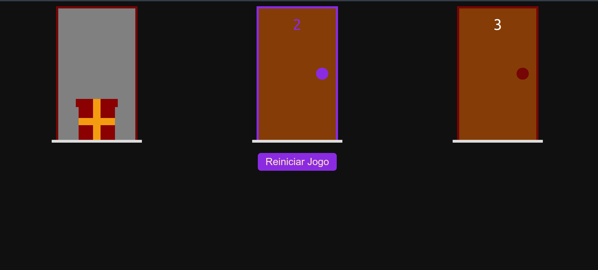

# Porta Premiada
Este é um jogo simples baseado no famoso problema de Monty Hall. No jogo, um jogador escolhe a quantidade de portas e seleciona a porta onde o presente estará escondido, enquanto outro jogador tenta adivinhar em qual porta o presente está.

## Tecnologias
- React.js
- Next.js
- TypeScript
- CSS Modules

## Como rodar este projeto
1. Clone este repositório

```bash
    https://github.com/carolcampos22/porta-premiada.git
```
2. Navegue até o diretório do projeto
```bash
    cd porta-premiada
```
3. Instale as dependências

```bash
    npm install
    #ou
    yarn install

```
4. Rode o projeto em modo de desenvolvimento

```bash
    npm run dev
    #ou
    yarn dev
```
O projeto estará disponível em http://localhost:3000.

## Como Jogar
1. Escolha o número de portas: O primeiro jogador define a quantidade de portas que deseja no jogo. O mínimo é 3 e o máximo é 100.

2. Selecione a porta com o presente: O primeiro jogador escolhe em qual porta o presente estará escondido. 

3. Tente adivinhar a porta correta: O segundo jogador escolhe uma das portas. 

4. Reinicie o jogo: Após uma rodada, os jogadores podem optar por jogar novamente, redefinindo o número de portas e a porta com o presente.

5. Casos em que uma mensagen de erro aparecerá: Caso seja escolhido um número de portas menor que três ou maior que 100; ou se o número da porta com presente escolhida pelo primeiro jogador for maior que o número de portas ou um valor negativo.

## Layout
1. Início


2. Jogo


## Próximos passos
- Responsividade

